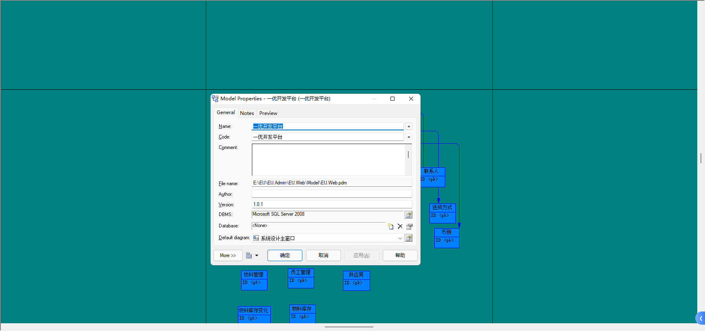
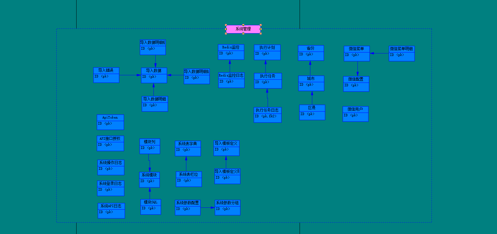
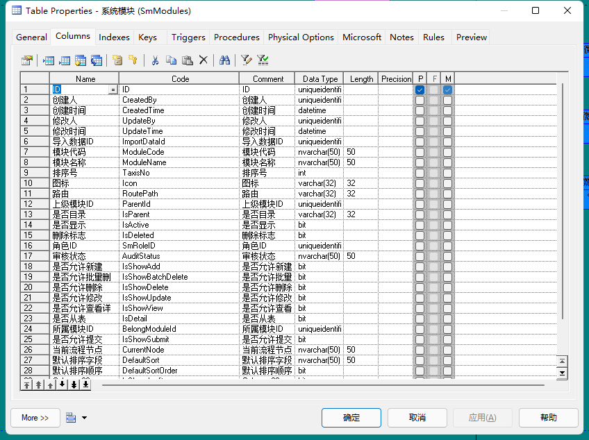

<div align="center"><h1>EU-Admin</h1></div>
<div align="center"><h3>EU（yiyou） 一心一意 做好每件事</h3></div>

## 前言

坐标苏州，2014年7月开始入行，学习.NET,最开始就学了webform，工作之后学了MVC、Sencha Touch（已抛弃技术）、JS、React、ReactNative、VUE，从.NetFramework 转到.NET CORE，很庆幸自己一直还是从事着开发的工作

从去年开始， 希望把前几年工作经历，以及想法做一个沉淀，故而有了这个项目。
新开的这个项目，期望实现这样的能力：业务人员只需关注实体的构建，业务服务的编写，以及路由的配置，未来的计划是所以基础代码一键生产。
部分代码是很早之前写的，可能不是那么规范，后面会统一优化掉

让业务的开发，变成简单的三步走：创建实体 >> 业务开发 >> 路由配置。

最近在重写BaseController，老的BaseController1因为很多代码继承了 就不删掉了改个名字，老的代码存在啥问题呢，接口返回不统一，结构混乱

阿里巴巴大神毕玄曾说过，"一个优秀的工程师和一个普通工程师的区别，不是满天飞的架构图，他的功底体现在所写的每一行代码上"。

与君共思共勉！

后期还想做一个APP 基于RN

[Gitee](https://gitee.com/xiaochanghai520/EU.Admin) | [Github](https://github.com/xiaochanghai/EU.Admin)

## 项目概述

前后端分离，使用 JWT 认证。

后端：基于 .NET6 和 EF Core，集成常用组件。

前端：基于Ant Design Pro，主技术栈：React、Ant Design

* 前端采用React 17、Ant Design Pro 5、TypeScript、umi3。
* 后端采用.NET7、Redis & Jwt。
* 权限认证使用Jwt，支持多终端认证系统。
* 支持加载动态权限菜单，多方式轻松权限控制。
* 数据库：SQL Server2014,设计文档见（EU.Web/Model）,依托于PowerDesigner进行数据库设计
* 所有基础列表查询通过数据库脚本配置，实现自定义查询，包括列的显示、类型、是否允许导出、宽度、顺序
* 自定义导入导出，实现常规操作
* 权限设计：用户关联角色，角色关联模块（菜单）

## 部署

前端利用Nginx部署，后端是用IIS


容器化部署
[Docker部署](./doc/Docker部署.md)
开发环境发布工具、生产环境运维工具开发中


## 在线体验

http://124.221.9.198:8005/

管理员： Admin  密码：1

## 快速开始

请参考[使用手册](./doc/使用手册.md)

本人本机环境：

VS2022

VS Code

SQL Server2014

node 16.13.2
 
## 前端开发注意事项

Node：建议v16或以上

安装依赖请支行：yarn

正常启动请运行: npm run dev

Mock测试模式请运行: npm run start

发布打包请运行: npm run build

```bash
├─EU.React                    # 前端
├─doc                         # 项目文档
├─EU.Web                      # 后端
   ├─EU.Common                # 公共方法
   ├─EU.Core                  # 基础设施
   ├─EU.DataAccess            # 仓储层
   ├─EU.Model                 # 实体层
   ├─EU.TaskHelper            # 任务方法类
   └─EU.Web                   # 服务层/表现层
   └─EU.Web.BackgroundJobs    # 任务
   └─EU.WeixinService         # 微信接口（微信公众号、微信支付、企业微信）
```

## 相关技术文档

### TypeScript
https://www.tslang.cn/docs/home.html

### React Js
https://react.docschina.org/docs/getting-started.html

### Ant Design 
https://ant.design/components/overview-cn/

### Ant Design Pro
https://pro.ant.design/zh-CN/docs/overview

### Ant Design Chart
https://charts.ant.design/zh

### Umi Js
https://umijs.org/docs/introduce/introduce

### Senparc
https://github.com/JeffreySu/WeiXinMPSDK

https://sdk.weixin.senparc.com/

### Blog.Core
https://gitee.com/laozhangIsPhi/Blog.Core

感谢这些优秀的开源项目！

## 系统能力

- 认证：集成Cookies、JWT；默认启用 JWT
- 授权：[基于策略（Policy）的授权](https://docs.microsoft.com/zh-cn/aspnet/core/security/authorization/policies?view=aspnetcore-6.0)
- ORM：[EF Core](https://docs.microsoft.com/zh-cn/ef/core/) 的 [Code First 模式](https://docs.microsoft.com/zh-cn/ef/core/managing-schemas/migrations/?tabs=dotnet-core-cli)
- 依赖注入：默认 DI 容器，实现自动注入
- 提供 Redis 做缓存处理
- 使用 Swagger 做api文档
- 支持 CORS 跨域
- 事件总线：[默认启用 BackgroupService](https://docs.microsoft.com/zh-cn/dotnet/core/extensions/queue-service?source=recommendations)，基于[Channel](https://docs.microsoft.com/zh-cn/dotnet/api/system.threading.channels.channel-1) 实现的单机版发布订阅；可替换为 Redis 的发布订阅（可用于分布式）；也可替换为 RabbitMQ 的发布订阅（可用于分布式）
- 定时任务：使用 Quartz.net 做任务调度
- 对象映射：AutoMapper
- RabbitMQ 消息队列
- EventBus 事件总线 
- 
## 数据库设计





## 一些Q&A

#### 为什么把 IServices 这些接口层给干掉了，仅留下实现层？

答：一般项目中会如有 IRepository 和 IServices 这些个抽象层，主要是为了控制反转（IoC），实现项目各层之间解耦，最终目的就是为了“高内聚，低耦合”。

个人认为，对于单体项目来说，做到高内聚即可，再追求完全的低耦合，会增加成本和困扰（举个简单的栗子：项目初期，业务大改是常有的事，改服务类的接口的事并不少见。除非说业务主体明确，需要修改的，并不是业务的接口，而是业务的具体实现）。

最后是这个项目，本就是为了追求最简三层单体。

#### 为什么不对仓储额外封装一层？

答：简单的项目基本上是单数据库的，且 EF Core 已经实现了工作单元和仓储模式，可以不用再封装一层。

当然，个人还是建议跟ABP框架那样再封装一层仓储，可以避免一些后续的开发运维问题（比如：系统迁移、重构等）。

#### 为什么前端用React?

答：现在国内大部分都是用vue，我个人可能比较喜欢react的语法吧，喜欢ant-design react版本，vue也会写写，后面会尝试深入学习vue

## 贡献

- 提 Issue 请到 gitee

## 联系我

邮箱：xiaochanghai@foxmail.com

部分内容来源与其他开源作者，谢谢

## 感谢

苏州市创采软件有限公司 费鹏先生