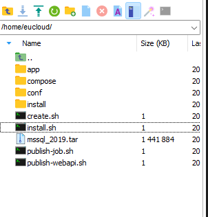
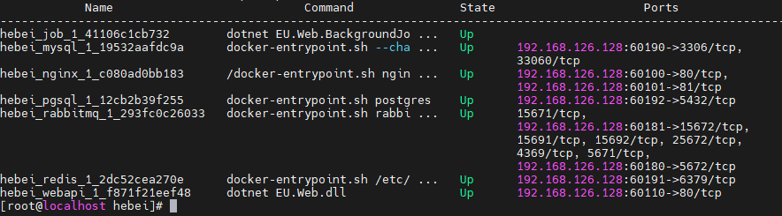

# Docker部署

## 前言
使用的是VMware+Centos7安装虚拟机进行测试
初识Docker猛如虎 一顿操作发现也没有那么难
Docker功能很强大 以下内容为个人一点点想法
资料来源与网络 存在错误请指正


## Step 1 VMware虚拟机安装Linux教程

[安装步骤](https://blog.csdn.net/weixin_52799373/article/details/124324077)


## Step 2 服务器环境搭建

- ** [服务器请自行添加sudo权限和免密](./服务器添加sudo权限和免密.md) **

- ** [初始化服务器](./初始化服务器.md) 使用脚本 install.sh**

- ** [创建开发环境](./创建开发环境.md) 使用脚本 create.sh，示例：create.sh develop 601 61 **

- ** [移除开发环境](./移除开发环境.md) 使用脚本 remove.sh，示例：remove.sh develop **

- ** 开发代码更新 **

  - ** 请使用dev/publish-xxx.sh脚本 **
  - ** 然后到对应项目文件夹（nanchong）开发环境下执行docker-compose down **
  - ** 再执行docker-compose up -d **
::: warning
**在开始操作前，请前往网盘下载[开发环境](https://www.aliyundrive.com/s/92DR12j4Ehk)至本地，解压后上传服务器用户目录下**



安装完成



## 一些Q&A

#### Windows系统重启后，发现虚拟机上不了网？

答：执行service network restart命令后出现下面的错误

```bash
Restarting network (via systemctl): Job for network.service failed because the control process exited with error code.

    See "systemctl status network.service" and "journalctl -xe" for details.    [FAILED]
```

1、先查看下你电脑有没有禁用了VMware DHCP service、VMware Workstation Service、VMware NAT service 这几个vm服务，如果禁用则开启，务必让这几个服务处于启动状态。[按win+R，输入services.msc] 如下图将其重启即可；

2、如果你改成了静态ip别忘了将BOOTPROTO改为static【此处我没有修改，默认DHCP】（ps：余下可以去了解一下动态ip跟静态ip）

显示ok说明重启网络成功，ip也对应查询出来了

然后会发现问题解决啦


未完待续。。。