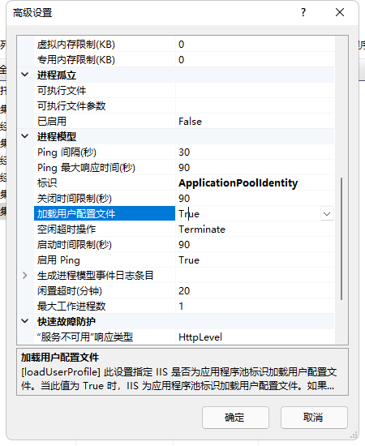

# 使用手册


## 1 如何快速开始

### 1.1 启动前端

进入项目下的 `/EU.React` 文件夹，打开命令窗口：

```bash
# 第1步：安装依赖
npm install --registry=https://registry.npm.taobao.org
yarn
# 第2步：启动项目
npm run dev
```

启动以后，命令窗口会有如下提示：

```bash
  App running at:
  - Local:   http://localhost:8000/ 
  - Network: http://192.168.1.107:8000/
```

打开 http://localhost:8000/ 访问前端。

### 1.2 启动后端

使用 VS2022 打开 `/EU.Web` 文件夹下的 `EU.Web.Core.sln`,依赖Redis

#### （1）设置启动项目并生成解决方案

将 `EU.Web` 设置为启动项目，同时，按 F6 生成解决方案。

#### （2）修改配置文件

修改 `appsettings.json` 配置文件里面的数据库连接字符串：

根据自己的具体情况修改 SQL Server 的连接字符串

```json
"ConnectionStrings": {
    "DbConnectionString": "server=localhost;database=EU_Cloud;uid=sa;pwd=123456;",
}
 "RabbitMQConfiguration": {
        "HostName": "localhost",
        "Port": "5672",
        "UserName": "Test",
        "Password": "Test",
        "MaxConnectionCount": "20",
        "MaxConnectionUsingCount": "1000"
    }
```

## 一些Q&A

#### 遇到IIS部署，出现接口返回数据数据量大，导致接口报500

最终抓取错误是
```bash
    Access to the path 'C:\\Windows\\TEMP\\ASPNETCORE_167d8244-6687-41e2-9d07-8bdef5575e20.tmp' is denied
```



该项配置要为tue，仅供参考！

未完待续。。。